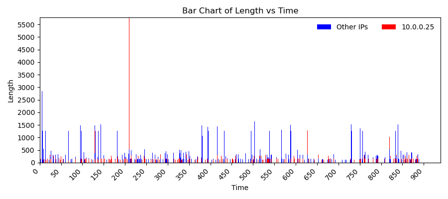
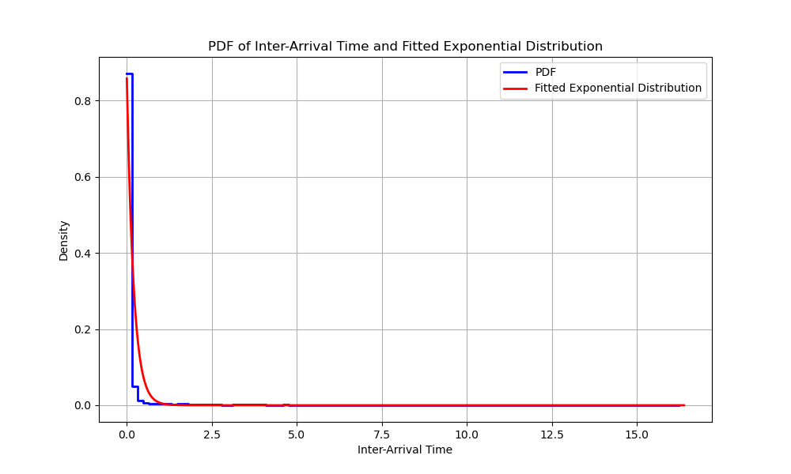
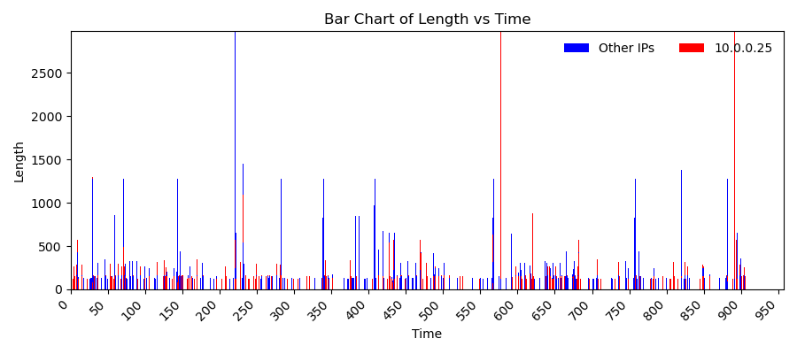
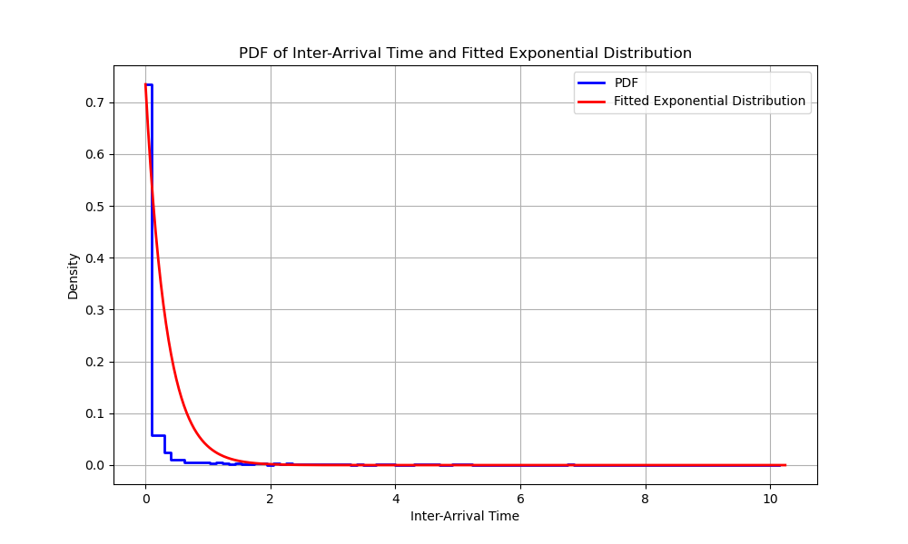
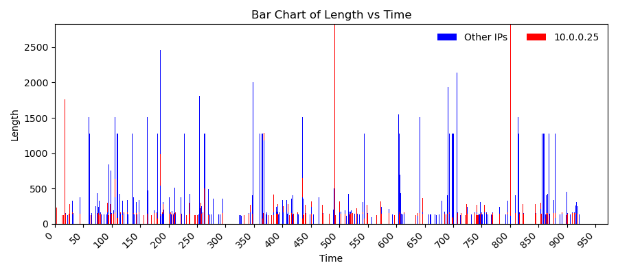
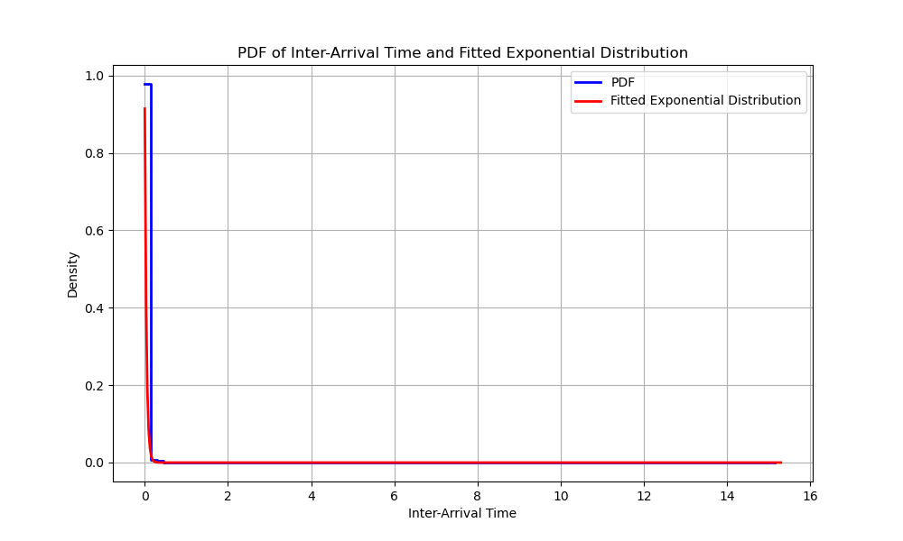
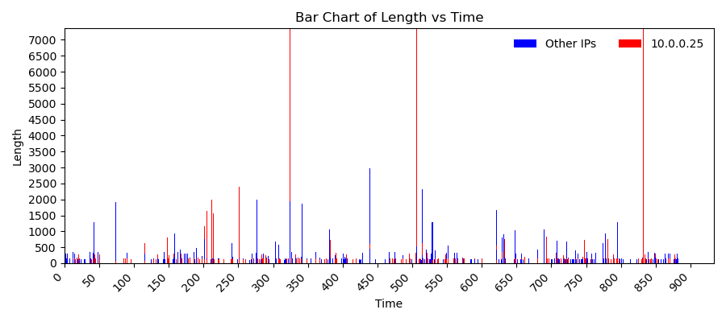
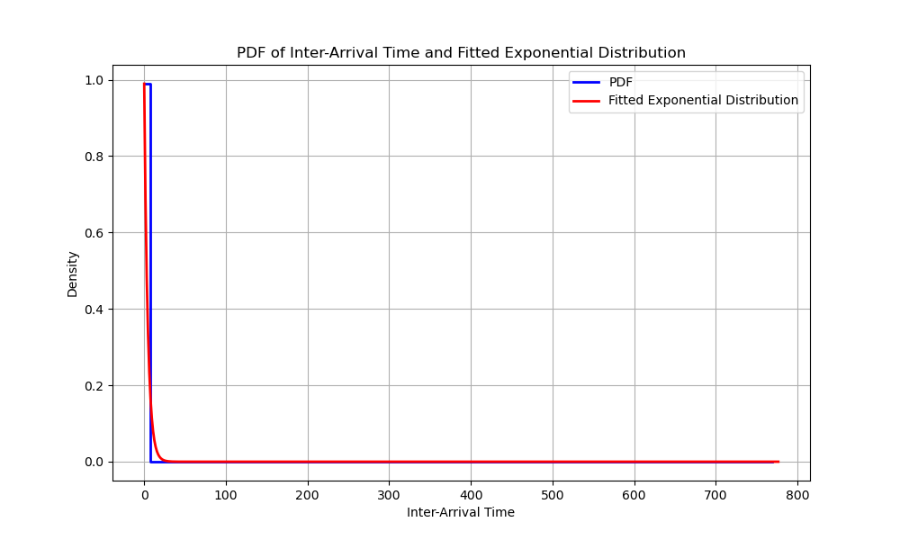
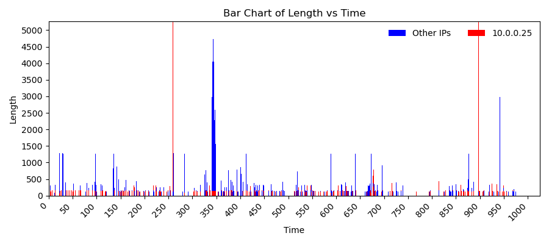
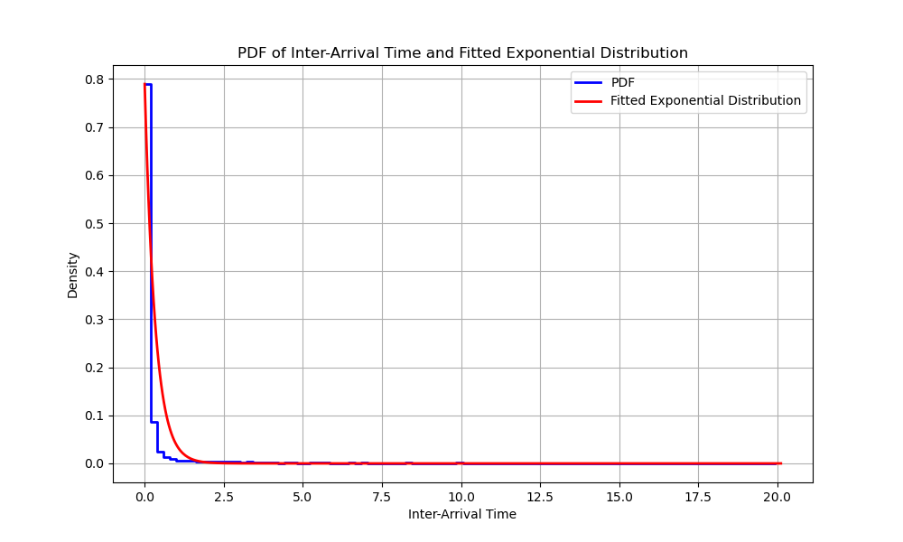

# Networks - Final Project
## Instance messages reference transportation analysis

### Introduction
- In this project, we based on the paper "Practical Traffic Analysis Attacks on Secure Messaging Applications"
- The paper claims that although instant message applications claim to be entirely secret, by simple statistics methods and filtering we can receive good information about the data that is transported.
- For each such group that is presented in the paper we plotted the inter-message delays and the message sizes, and we looked for unique characteristics for each group - messages, images, videos, files, and audio groups.
- We considered 2 cases:
	- The attacked user is always active in (at most) a single IM group.
	- The attacked user may be active in several IM groups simultaneously.

### Directories and files
- src directory, which includes all your code.
- resources directory: includes some sample raw data for the work (traces / pcap files etc.).
- res directory: includes the results (text files / Python pickle files).

### Dataset details and additional information
- We exported every Wireshark record to a csv files for the analyzing.
- Every csv file contains the following columns:
    - No. - the packet number 
    - Time - the timestamp of when the packet or message was captured in milliseconds
    - Source - the source IP address
    - Destination - the destination IP address
    - Protocol - the network protocol used for the communication
    - Length - the length of the packet in bytes including the headers and the data payload
    - Info:
        - 443 > 35260: This part indicates the source and destination ports of the TCP communication. "443" is the source port, and "35260" is the destination port.
        - [flags]: These are TCP flags set in the packet.
         for example [PSH, ACK] that represents "Push" for telling the receiving side to deliver the data to the application immediately, rather than buffering it.
         and in addition, ACK for "Acknowledgment" and indicates that the packet is an acknowledgment of previously received data.
        - Seq=1: It represents the sequence number of the packet.
        - Ack=360: It represents the acknowledgment number - used to inform the sender about the number of bytes it has received successfully.
        - Win=65535: It represents the number of bytes that can be sent before waiting for an acknowledgment.
        - Len=1392: It represents the length of the actual data of the TCP segment in bytes.
- The IM platform WhatsApp uses TLSv1.2 protocol which is a cryptographic protocol used to secure communications over a computer network
    - It ensures that data transmitted between the client and server is encrypted
    - It allows the client and server to verify each other's identities using digital certificates, preventing man-in-the-middle attacks
- Each SIM event, e.g., a sent image, produces a burst of MTU-sized packets in the encrypted traffic with very small inter-packet delays.

### The cleaning process:
Initially, our approach involved filtering based on a singular protocol that appeared recurrently within the dataset. However, it became evident that this method inadvertently excluded a substantial amount of communication data. As a remedy, rather than focusing on a single protocol, we chose to filter out non-relevant protocols that were conclusively not transmitting WhatsApp communication data, such as DNS and NTP, among others.

Subsequently, in an effort to further refine the dataset and eliminate noise, we evaluated the IPs from which messages were being sent. It was observed that certain messages were routed through servers not affiliated with Facebook, the parent company of WhatsApp. These unrelated servers were then filtered based on their geographical location, specifically whether they were located within Israel. Generally speaking, the majority of WhatsApp communication is relayed via Facebook's servers. If the communication isn't directed straight to WhatsApp, it's likely due to the substantial size of the transmitted data, which is then routed through a local server, typically residing in Israel as an ISP.

In addition, we implemented further IP filtering based on the median packet size and the number of packets dispatched from that address. An IP from which a substantial number of packets (greater than 1000) were dispatched was considered significant. If the median size exceeded 500, it was inferred that the transmitted packets probably contained pertinent information. Upon closer inspection, we noted that servers transmitting sizable data typically had a median packet size of around 1200, establishing 500 as a safety threshold.

To address potential anomalies or aberrations in packet sizes, we posited that if the top three largest packets (or the top 0.001% of packet lengths, whichever is smaller) are more than three times the size of the subsequent packet, it likely indicates an inadvertent error in the recording, warranting the removal of those packets.

Lastly, the filtering was further refined by examining the content detailed in the 'info' description of each packet. All packets labeled 'Len=0' were excluded since this value denotes the size of the transferred data excluding headers, leading us to deduce that these packets essentially transmitted no data. Finally, we surveyed the varying types of 'info' and, based on their descriptions and average packet sizes, made determinations on which to omit. For instance, packets described as 'Initial', which denotes the inception of a connection, or 'Client Hello', which is also devoid of pertinent data, were among those excluded.

### Deducing the groups an attacked user take part in using the techniques detailed in the paper:
#### When the attacked user is always active in (at most) a single IM group:
We initiated our study by capturing the traffic from five distinct WhatsApp groups, each emphasizing a unique central theme. One group primarily focused on images, the second on audio, the third on videos, the fourth on file transfers, and the last presented a mixture of all types, with a particular emphasis on text messages. As inferred from the context of this section, we postulated that a participant is active in, at most, one group at any given time.
Following the recordings of each of the groups, we subjected them to a filtering process, as detailed above.

In alignment with the paper, we constructed visual representations elucidating both the inter-message delays and the dimensions of individual messages. Furthermore, we generated probability density functions (PDFs) for each distinct group classification. These graphical analyses provide substantive insights into the underlying traffic patterns and behaviors.
By analyzing these graphical representations, we can derive several key observations. Firstly, the inter-message delays offer an understanding of the temporal distribution and pacing of messages within the network, potentially revealing periods of high or low activity. Such insights can be crucial for identifying regular transmission intervals or bursts of communication which may correspond to specific operational patterns or anomalies.

Secondly, by assessing the dimensions of individual messages, we gain insight into the volume and type of data being transmitted. Larger message sizes might indicate transmission of multimedia files or bulk data transfers, whereas smaller messages could be associated with control signals or textual communications.

Moreover, the probability density functions (PDFs) for each distinct group classification offer a comprehensive overview of the statistical distribution of the data. These functions can help identify outliers or predominant modes in the data, further contributing to our understanding of the traffic dynamics.

Presented below are the aforementioned figures. The graph depicting inter-message delays and message sizes is distinguished by two colors. One color represents the items sent by the user whose communication we monitored (with an internal IP of 10.0.2.15), while all other incoming traffic is denoted by a different color.

  
  

  
  

  
  

  
  

  
  

#### When the attacked user is may active in several IM groups simultaneously:

we weren't able to identify unique characteristics for each group. we tried different approaches:

### References
- The paper: https://www.ndss-symposium.org/wp-content/uploads/2020/02/24347-paper.pdf
- The researchers GitHub repo: https://github.com/SPIN-UMass/IMProxy

### Authors
- Wolfman Ohad, https://www.linkedin.com/in/ohad-wolfman/
- Chesler Shira, https://www.linkedin.com/in/shira-chesler-4438b5222/

