# Networks - Final Project
## Instance messages reference transportation analysis

### Introduction
- In this project, we based on the paper "Practical Traffic Analysis Attacks on Secure Messaging Applications"
- The paper claims that although instant message applications claim to be entirely secret, by simple statistics methods and filtering we can receive good information about the data that is transported.
- For each such group that is presented in the paper we plotted the inter-message delays and the message sizes, and we looked for unique characteristics for each group - messages, images, videos, files, and audio groups.
- We considered 2 cases:
	- The attacked user is always active in (at most) a single IM group.
	- The attacked user may be active in several IM groups simultaneously.

### Directories and files
- src directory, which includes all your code.
- resources directory: includes some sample raw data for the work (traces / pcap files etc.).
- res directory: includes the results (text files / Python pickle files).

### Dataset details and additional information
- We exported every Wireshark record to a csv files for the analyzing.
- Every csv file contains the following columns:
    - No. - the packet number 
    - Time - the timestamp of when the packet or message was captured in milliseconds
    - Source - the source IP address
    - Destination - the destination IP address
    - Protocol - the network protocol used for the communication
    - Length - the length of the packet in bytes including the headers and the data payload
    - Info:
        - 443 > 35260: This part indicates the source and destination ports of the TCP communication. "443" is the source port, and "35260" is the destination port.
        - [flags]: These are TCP flags set in the packet.
         for example [PSH, ACK] that represents "Push" for telling the receiving side to deliver the data to the application immediately, rather than buffering it.
         and in addition, ACK for "Acknowledgment" and indicates that the packet is an acknowledgment of previously received data.
        - Seq=1: It represents the sequence number of the packet.
        - Ack=360: It represents the acknowledgment number - used to inform the sender about the number of bytes it has received successfully.
        - Win=65535: It represents the number of bytes that can be sent before waiting for an acknowledgment.
        - Len=1392: It represents the length of the actual data of the TCP segment in bytes.
- The IM platform WhatsApp uses TLSv1.2 protocol which is a cryptographic protocol used to secure communications over a computer network
    - It ensures that data transmitted between the client and server is encrypted
    - It allows the client and server to verify each other's identities using digital certificates, preventing man-in-the-middle attacks
- Each SIM event, e.g., a sent image, produces a burst of MTU-sized packets in the encrypted traffic with very small inter-packet delays.

### The cleaning process:
Initially, our approach involved filtering based on a singular protocol that appeared recurrently within the dataset. However, it became evident that this method inadvertently excluded a substantial amount of communication data. As a remedy, rather than focusing on a single protocol, we chose to filter out non-relevant protocols that were conclusively not transmitting WhatsApp communication data, such as DNS and NTP, among others.

Subsequently, in an effort to further refine the dataset and eliminate noise, we evaluated the IPs from which messages were being sent. It was observed that certain messages were routed through servers not affiliated with Facebook, the parent company of WhatsApp. These unrelated servers were then filtered based on their geographical location, specifically whether they were located within Israel. Generally speaking, the majority of WhatsApp communication is relayed via Facebook's servers. If the communication isn't directed straight to WhatsApp, it's likely due to the substantial size of the transmitted data, which is then routed through a local server, typically residing in Israel as an ISP.

In addition, we implemented further IP filtering based on the median packet size and the number of packets dispatched from that address. An IP from which a substantial number of packets (greater than 1000) were dispatched was considered significant. If the median size exceeded 500, it was inferred that the transmitted packets probably contained pertinent information. Upon closer inspection, we noted that servers transmitting sizable data typically had a median packet size of around 1200, establishing 500 as a safety threshold.

To address potential anomalies or aberrations in packet sizes, we posited that if the top three largest packets (or the top 0.001% of packet lengths, whichever is smaller) are more than three times the size of the subsequent packet, it likely indicates an inadvertent error in the recording, warranting the removal of those packets.

Lastly, the filtering was further refined by examining the content detailed in the 'info' description of each packet. All packets labeled 'Len=0' were excluded since this value denotes the size of the transferred data excluding headers, leading us to deduce that these packets essentially transmitted no data. Finally, we surveyed the varying types of 'info' and, based on their descriptions and average packet sizes, made determinations on which to omit. For instance, packets described as 'Initial', which denotes the inception of a connection, or 'Client Hello', which is also devoid of pertinent data, were among those excluded.

### Deducing the groups an attacked user take part in using the techniques detailed in the paper:
#### When the attacked user is always active in (at most) a single IM group:
We initiated our study by capturing the traffic from five distinct WhatsApp groups, each emphasizing a unique central theme. One group primarily focused on images, the second on audio, the third on videos, the fourth on file transfers, and the last presented a mixture of all types, with a particular emphasis on text messages. As inferred from the context of this section, we postulated that a participant is active in, at most, one group at any given time.
Following the recordings of each of the groups, we subjected them to a filtering process, as detailed above.

In alignment with the paper, we constructed visual representations elucidating both the inter-message delays and the dimensions of individual messages. Furthermore, we generated probability density functions (PDFs) for each distinct group classification. These graphical analyses provide substantive insights into the underlying traffic patterns and behaviors.

By analyzing these graphical representations, we can derive several key observations. By assessing the dimensions of individual messages, we gain insight into the volume and type of data being transmitted. Larger message sizes might indicate transmission of multimedia files or bulk data transfers, whereas smaller messages could be associated with control signals or textual communications.

Moreover, the probability density functions (PDFs) for each distinct group classification offer a comprehensive overview of the statistical distribution of the data. These functions can help identify outliers or predominant modes in the data, further contributing to our understanding of the traffic dynamics.

During the data acquisition process, we meticulously logged the timestamps of transmitted items, subsequently incorporating this data into the analyses of inter-message delays and message sizes. An examination of the results reveals that while our filtering mechanism is not infallible, leading to the presence of some noise in the recordings, the overall outcome is commendable, as evidenced by the high correlation observed (It is possible to detect wether the user is active in the group).

Presented below are the aforementioned figures. The graph depicting inter-message delays and message sizes is distinguished by two colors. One color represents the items sent by the user whose communication we monitored (with an internal IP of 10.0.2.15), while all other incoming traffic is denoted by a different color.

 
> Images group graphs

  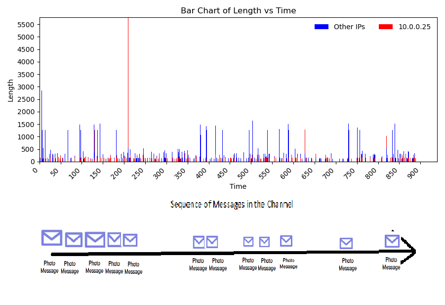
  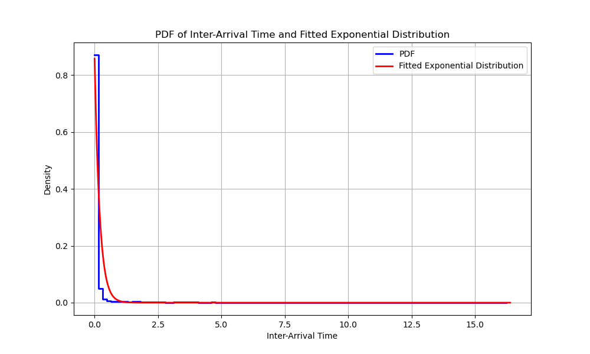

 
> Audio group graphs

  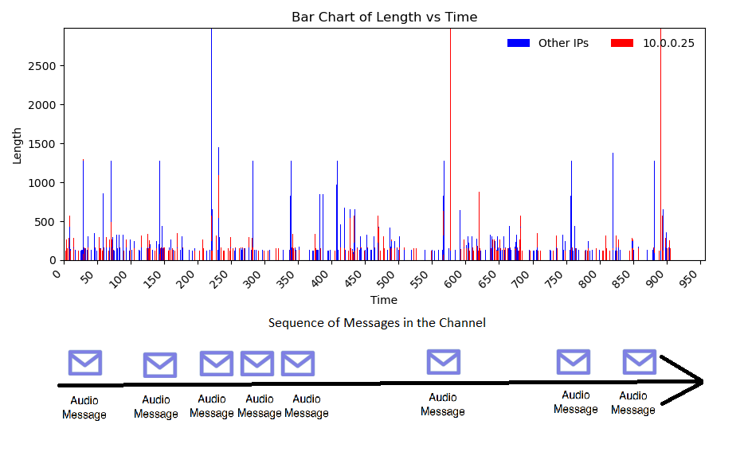
  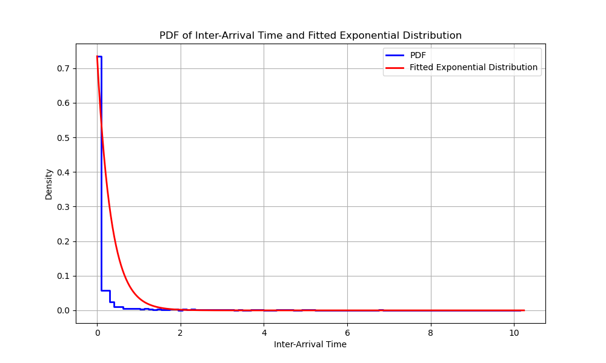

 
> Videos group graphs

  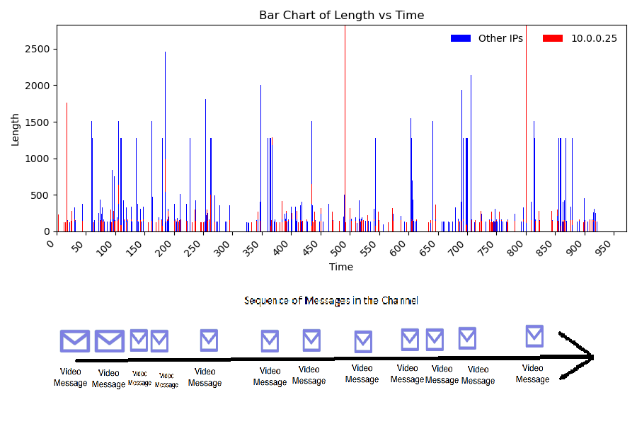
  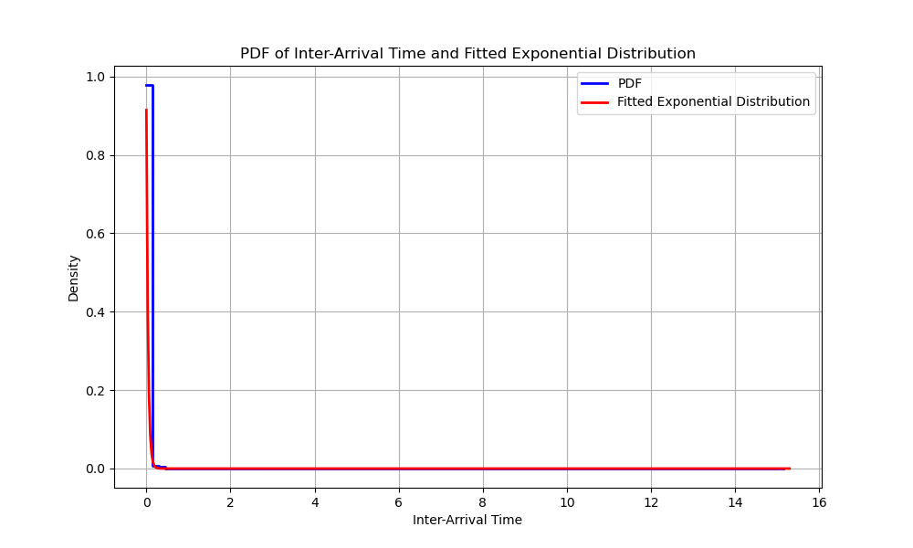

 
> Files group graphs

  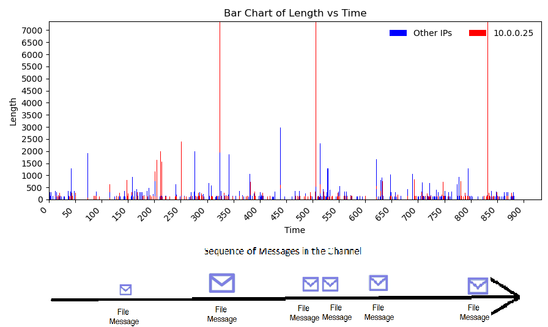
  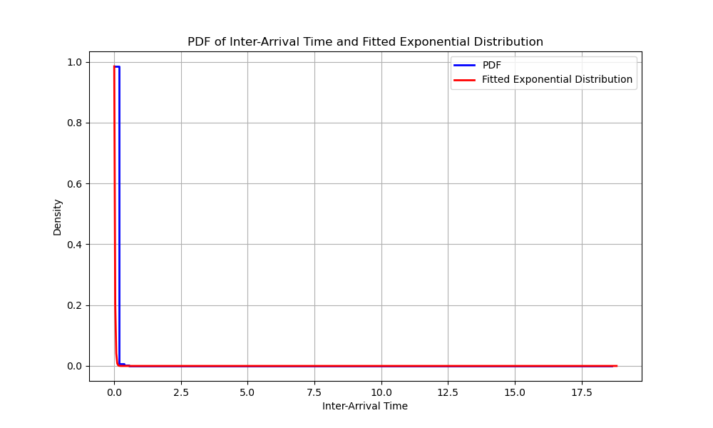

 
> Mixed (Mostly messages) group graphs

  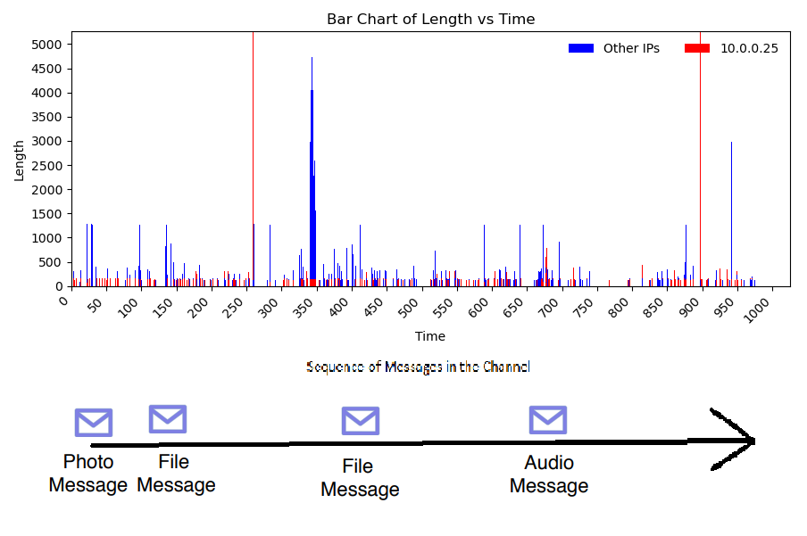
  

Beyond the groups previously discussed, we also captured data from a group where constant background noise was present, attributed to the continuous operation of Spotify. This dataset too underwent the same rigorous filtering process as its counterparts. After extracting the graph representing this 'background-noise group' and subjecting it to our filtering technique, an immediate observation points to the significant noise within. Yet, once filtered, the resultant graph not only showcased a marked diminution in disruptions, thereby enhancing data clarity, but also facilitated a clear demarcation and recognition of the actual underlying traffic trends and events.

 
> Noisy before filtering (left), the rest is the same

  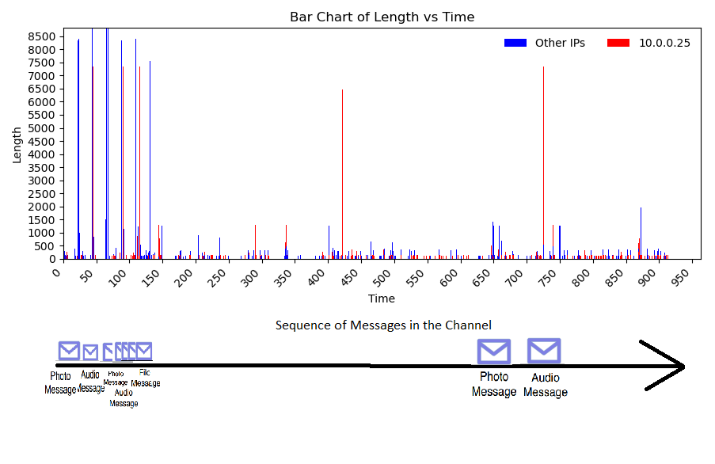
  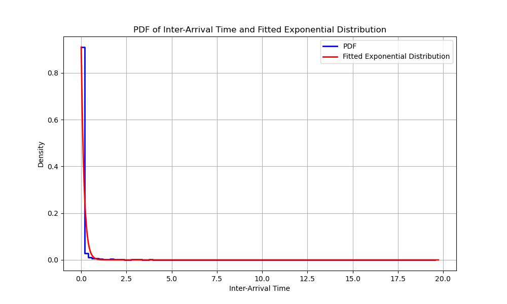
  
  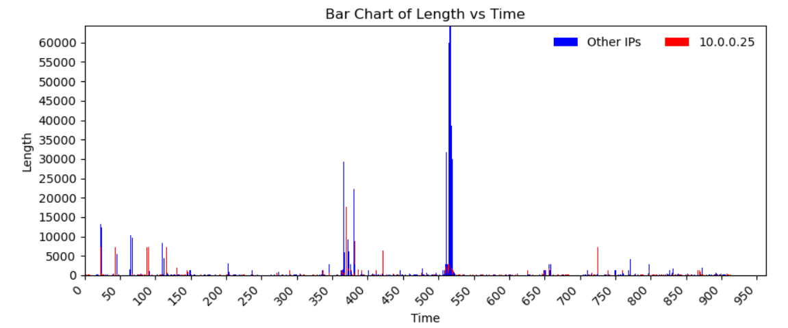

Following our individual analysis of each group, we sought to identify unique characteristics inherent to each one. In the referenced article, the algorithm utilizes the distribution of message sizes to attribute an estimated size to a specific type of message, thereby synthesizing a particular channel. In that study, the Complementary Cumulative Distribution Function (CCDF) serves as a distinguishing feature for each group. A CCDF, for context, represents the probability that a random variable exceeds a particular value, typically offering a perspective inverse to the standard Cumulative Distribution Function (CDF) which illustrates the probability that a variable is less than or equal to a certain value.

Contrary to the findings presented in the article, our CCDF did not manifest a distinctive characteristic for any of the groups. It appears that the distribution among the groups is largely analogous, even if the exact values differ; the trajectory of all groups follows a consistent direction.

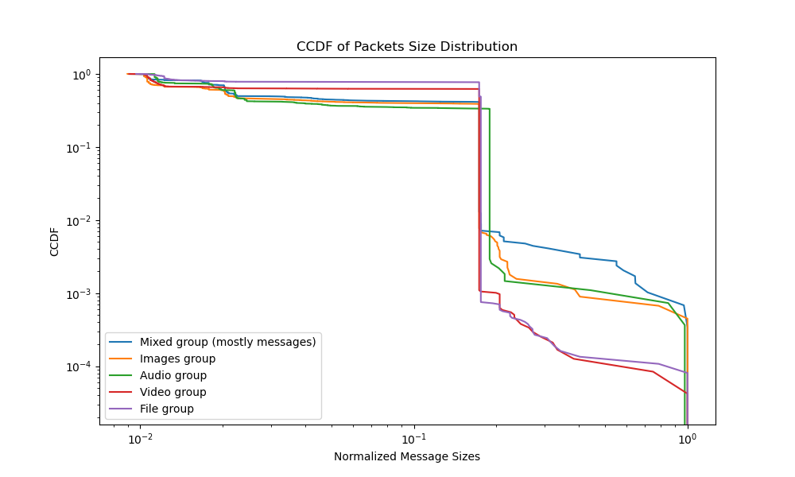

Following the inconclusiveness of the CCDF in differentiating the groups, alternative analytical approaches were explored to discern inherent characteristics within each group. Delving into basic statistics and the Mean Rolling Average Length, we unearthed salient insights:

1. **Basic Statistics (Mean, Median, Variance):**

	**Our Results:**

		Images
		Mean: 590.2623097582812
		Median: 155.0
		Variance: 357531.59180052264

		------

		Audio
		Mean: 533.593487010611
		Median: 150.0
		Variance: 331351.81601905805

		------

		Videos
		Mean: 832.1665263866678
		Median: 1274.0
		Variance: 331890.62691191706

		------

		Files
		Mean: 838.881900560391
		Median: 1274.0
		Variance: 332855.6882516368

		------
		
		Mixed
		Mean: 638.8996929375639
		Median: 166.0
		Variance: 393327.1162149332

		------

    - **Mean:** This metric offers an average representation of message sizes across data points for each group. Comparative analysis elucidates fundamental disparities: the "Videos" and "Files" groups exhibit significantly elevated mean values relative to the "Images" and "Audio" groups, alluding to inherent differences in their content constitution.
  
    - **Median:** As a robust measure of central tendency, resilient to outlier perturbations, the median delineates distinct variations across groups. For instance, the pronounced median values for the "Videos" and "Files" groups underscore the divergence in typical message sizes across cohorts.
  
    - **Variance:** This metric elucidates the dispersion within the data. The pronounced variance observed in the "Mixed" group intimates a more expansive gamut of message sizes, concomitant with its diverse content spectrum.

2. **Mean Rolling Average Length:**

	**Our Results:**

		Images Mean Rolling Average Length: 591.1035209688248
		
		Audio Mean Rolling Average Length: 534.3432085168849

		Videos Mean Rolling Average Length: 832.4223003410125

		Files Mean Rolling Average Length: 839.1627974947703

		Mixed Mean Rolling Average Length: 640.3060574948666

    - Yielding a smoothed continuum of message lengths over a predetermined window, this metric furnishes insights into overarching trends, eschewing transient data perturbations. The proximal values between the mean and the mean rolling average length for each cohort evince consistent data trajectories over the observational expanse. Such temporal consistency underscores the intrinsic data flow behavior endemic to each group.

In summation, notwithstanding the limitations of the CCDF, the aforementioned metrics proffer a nuanced perspective. Disparities in the mean, median, variance, and the Mean Rolling Average Length serve as pivotal indicators in demarcating and classifying each group predicated on their content behavior and transmission modalities. This analytical paradigm elucidates the distinctive signatures inherent to each group, advancing the overarching research objective of discerning unique group characteristics.

#### When the attacked user is may active in several IM groups simultaneously:

In conclusion, our overarching aim was to ascertain whether, given the known traffic of a specific group member and the traffic of an unidentified member, we could accurately determine the latter's group affiliation. Initially, we recognized that due to the unidentified member's concurrent participation in multiple groups, it was imperative to eliminate traffic conspicuously unaffiliated with the mutual group. This determination was made based on the deviation between the maximum traffic values within a specified second exceeding a certain threshold.

Subsequent to this filtration process (which, it should be noted, was similarly applied to the previously discussed groups), we sought to juxtapose the outbound traffic from the known member against the inbound traffic to the unidentified member, and vice versa, including the traffic incoming to both. Our anticipation was that numerous overlapping traffic instances would be evident, considering their mutual group membership. However, our empirical observations did not corroborate this expectation.

Upon further scrutiny of the data, we discerned that even after isolating traffic specific to the group, the magnitude of the data at the unidentified member's disposal, whether outbound or inbound, was considerably more voluminous. Consequently, our subsequent hypothesis entailed the normalization of the data volume directed to both members in an attempt to identify any semblance of similarity. To effectuate this normalization, we employed Cumulative Distribution Function (CDF) graphs for both entities and evaluated the congruence between the graphs. While certain congruencies were observed at specific "steps", these were not extensive.

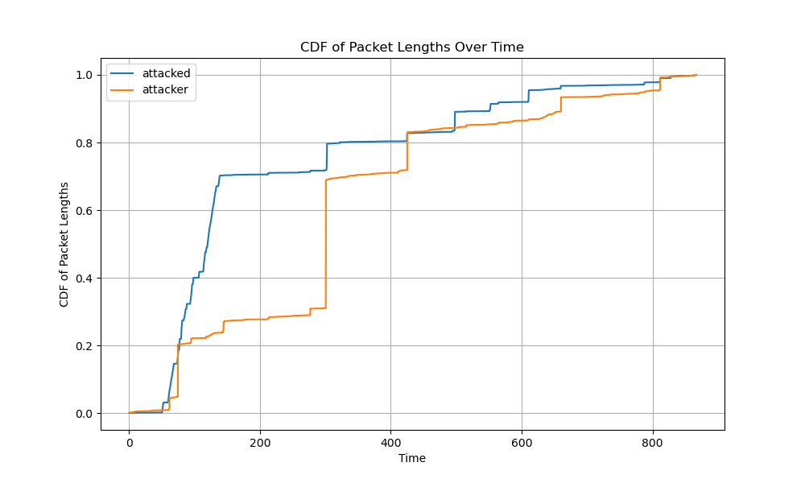

Subsequently, we hypothesized that focusing solely on the data dispatched by the known member and received by the unidentified member might provide a clearer picture. Indeed, the resultant CDF graphs bore significant resemblance, with both depicting analogous jumps. To further substantiate this observation, we computed the Pearson correlation between these two graphs, yielding a significant correlation coefficient of 92.7%.

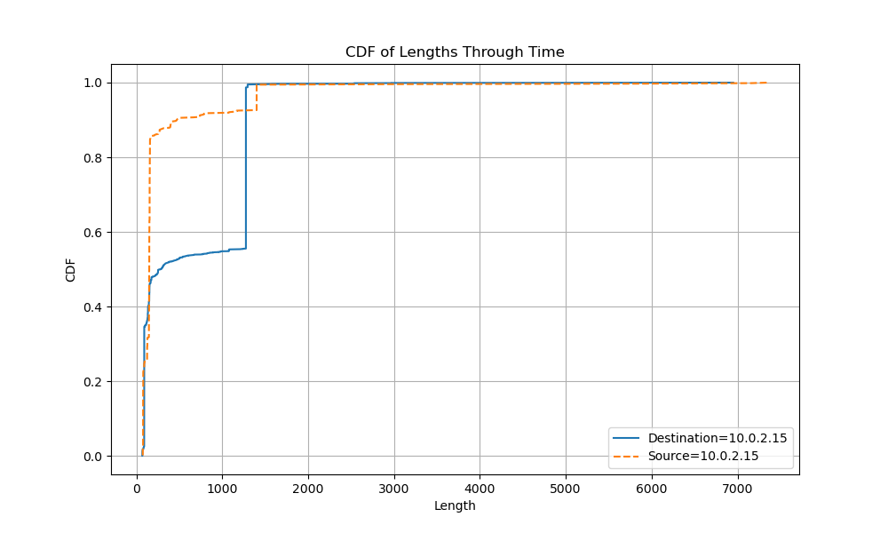

In summary, our findings suggest that it is indeed feasible to discern an unidentified member's specific group association, even in the presence of simultaneous activities across multiple groups.

### References
- The paper: https://www.ndss-symposium.org/wp-content/uploads/2020/02/24347-paper.pdf
- The researchers GitHub repo: https://github.com/SPIN-UMass/IMProxy

### Authors
- Wolfman Ohad, https://www.linkedin.com/in/ohad-wolfman/
- Chesler Shira, https://www.linkedin.com/in/shira-chesler-4438b5222/

